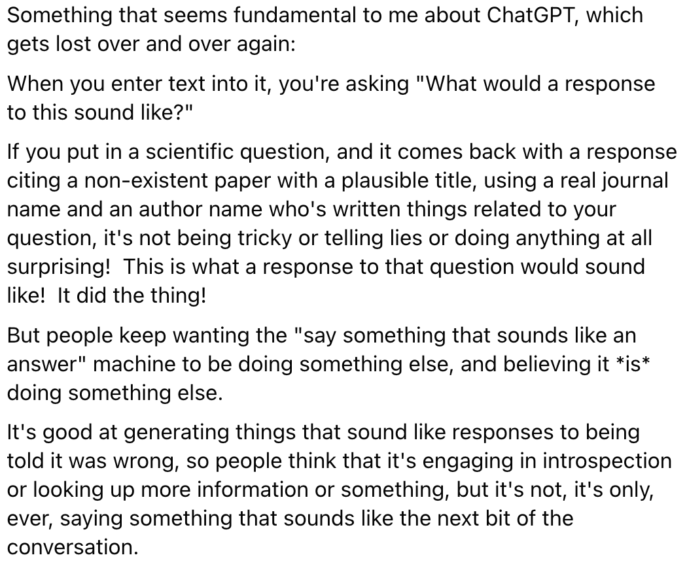

Est-ce qu'un test auquel pourrait répondre une intelligence artificielle de façon adéquate permet vraiment de mesurer un apprentissage réalisé ? [[@ceresChatGPTComingClassrooms]]

pour une appropriation critique de l'outil dans l'enseignement.

# attribuer, citer

## absence d'attributions ou mauvaises attributions de ChatGPT

> When students asked it to back up an argument with citations from scholarly texts, it misattributed work to the wrong authors

ChatGPT envoie des réponses qui semblent être celles que l'on attend (mais qui ne sont pas forcément vraies)

source : https://twitter.com/FrKadel/status/1644096510357913600

# Faire appel à l'expérience des étudiants

> Kudina thinks ChatGPT might also spur educators to get more creative with assignments, for example by designing them to draw from students’ personal experiences, information that ChatGPT couldn’t have picked up from its training data[[@ceresChatGPTComingClassrooms]]

Comment enseigner avec ChatGPT [[@peronChatGPTEnseignerAvec]]

# détecter les erreurs de ChatGPT

Dans 80% des cas, ChatGPT apporte de nouveaux éléments à l'appui des théories fausses qu'on lui soumet [[@CouldChatGPTBecome]]